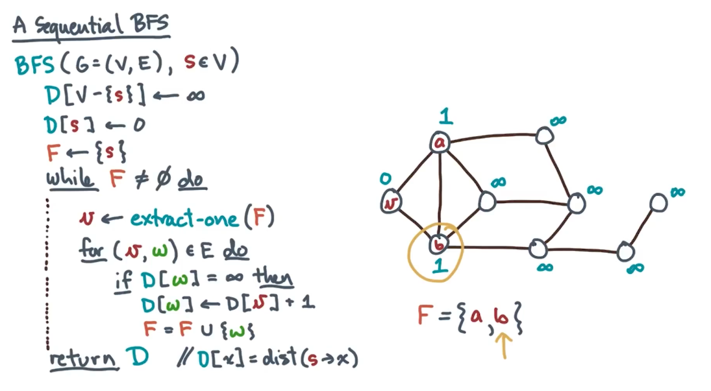
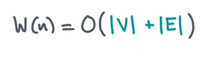
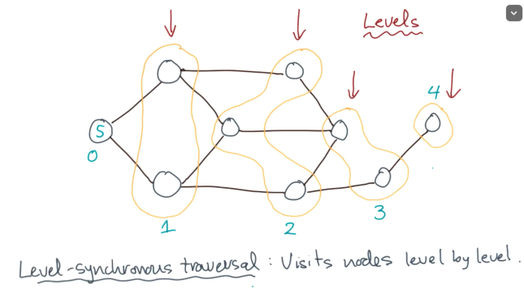
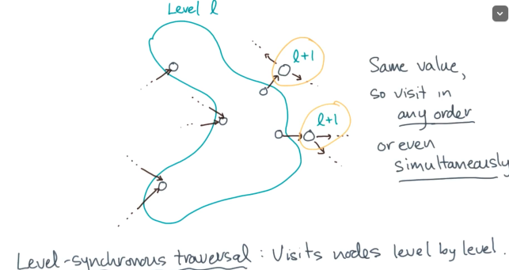
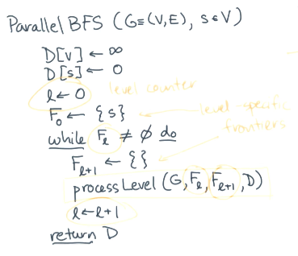
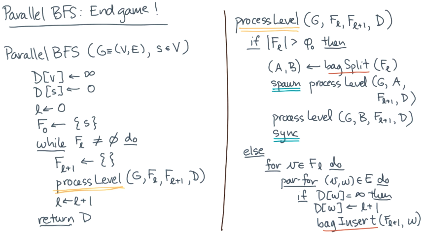

# Breadth First Search


## Sequential BFS

```
BFS(G=(V, E), seV)
	D[V-{s}] <- inf // initialize all distances to infinity
	D[s] <- 0
	F <- {s}
	while F != 0 do // when F is not empty 
		v <- extract-one(F)
		for (v, w) e E do // loop over all v's neighbours
			if D[w] = inf then
				D[w] <- D[v] + 1
				F = F U {w}
	return D // D[x] = dist(s->x)
	
```





## Level Synchronous BFS

The Idea: 





Parallel BFS: 

1. Level synchronous
2. Process an entire level in parallel

```
Parallel BFS (G=(V, E), seV)
	D[v] <- inf
	D[s] <- 0 
	l <- 0
	F_0 <- {s}
	while F_l != 0 do 
		F_(l+1) <- {}
		processLevel(G, F_l, F_(l+1), D)
		l <- l + 1
	return D
```



- Span <= Diameter of graph


Bag to hold Frontiers

- Unordered collection
- With repetition

