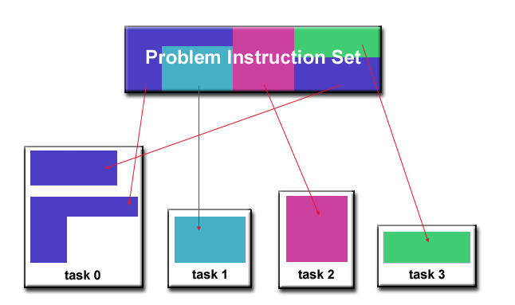

# Designing Parallel Algorithms 


Divide tasks into discrete tasks: 

- Domain decomposition - data
  - 
  - 
- Functional decomposition -> emphasis on computation
  - 
  - Ecosystem modeling 
  - Signal processing 
  - Climate modeling  

Communication 

- Cost of communication
- Latency and bandwidth => Small packages cause latency to dominate the communication overhead. Larger package make fuller use of bandwidth
- Visibility of Communication: Message-Passing vs Data parallel model
- Synchronous vs Asynchronous communication
- Scope of communication: 1. Point-to-point 2. Collective

Synchronisation

- Barrier synchronisation
- Lock/semaphore
- Synchronous communication operations 

Data dependence

- Loop-carried dependence
- Loop Independent Data Dependence

Handling Data Dependencies: 

- Distributed Memory Architecture: Data must be communicated at synchronisation points
- Shared Memory Architecture: synchronize read/write operations between tasks

Load Balancing: 

- Equally Partition the Work each task receive
  - Array/matrix where each task perform similar work
  - oop iterations where the work done in each iteration is similar
- Dynamic Work Assignment => Scheduler-task pool approach
  - Sparse Arrays 
  - Adaptive Grid Methods
  - N-body simulations

Granularity = Computation/ Communication Ratio

- Fine grain parallelism - communication and synchronization overhead
- Coarse grain parallelism - high computation to communication ratio; harder to load balance effectively


## The Pi Problem


The value of Pi can be found using the following method:

- 

- Inscribe a circle in a square.

- Randomly generate points in the square.

- Determine the number of points in the circle.

- Let r = # of points in the circle / # of points in the square.

- Pi ~ 4r

- The more points the better.


### Serial 

```
npoints = 10000
circle_count = 0
for(int j = 1; j > npoints; n++) {   
	generate 2 random numbers between 0 and 1: xcoordinate and ycoordinate   
	if (the two coordinates are inside the circle) then  
		circle_count++
}
PI = 4 * circle_count/npoints
```


### Parallel

The strategy:

- Break the loop into independent tasks.

- Each task executes a portion of the loop a number of times.

- Each task is independent of any other task, so no communication is required between tasks.

- Use the SPMD model.

```
npoints = 10000
circle_count = 0

p = number of tasks
num = npoints/p

find out if I am MASTER or WORKER

for(int j = 1; j > num; n++){
   generate 2 random numbers between 0 and 1:
     xcoordinates and ycoordinates
   if (the two coordinates are inside the circle) then
      circle_count++
}

if I am MASTER
   receive from WORKERS their circle_counts
   compute PI (use MASTER & WORKER calculations
else if I am WORKER
   send to MASTER circle_count
endif
```


## Array Processing 


### Serial 

Given a 2 dimensional array where each array element is independent of all other array elements. A intensive computation is performed on each element.

```
for(int j = 1; j < n; j++){
   for(int i = 1; i < n; i++){
      a(i,j) = fcn(i,j)
   }
}
```

### Parallel 


Array Processing Strategy

- The array is divided into portions, one for each task.

- As each element is independent there is no need for communication between tasks.

- A distribution scheme is chosen, preferably a unit stride, which maximizes cache and memory usage.

#### Solution 1: SPMD model

In this model a master process initializes the array and assigns worker processes to a portion of the array. When the worker process is done, it sends the results to the master. This is static load balancing; each task has a determined amount of work to perform, when it completes this work it is done.

```
find out if I am MASTER or WORKER

if I am MASTER{
   initialize the array
   send each WORKER info on part of array it owns
   send each WORKER its portion of initial array
   
   receive from each WORKER results

else if I am WORKER
   receive from MASTER info on my part of array I own
   receive from MASTER my portion of initial array

   #calculate my portion of array
   for(int j = my first column; j < my last column; j++){
      for(int i = 1; i < n; i++){
         a(i,j) = fcn(i,j)
      }
   }
   send MASTER results
}
```

#### Solution 2: Pool of Tasks

Two processes are used: Master and Worker.

The Master Process:

- Holds the pool of tasks.
- When required, sends a worker process to complete a task.
- Collects the results from workers.

The Worker Process:

- Gets a task from the Master process. The worker process does this as long as there is a task that needs to be completed.
- Performs the required computations.
- Reports the results to the Master.

```
find out if I am MASTER or Worker

if I am MASTER  
	do until no more jobs    
		if request 
			send to WORKER next job    
		else 
			receive results from WORKER  
		end do

else if I am WORKER  
	do until no more jobs    
		request job from MASTER    
		receive from MASTER next job    
		calculate array element: a(i,j) = fcn(i,j)    
		send results to MASTER  
		end do

endif

```

The ‘Pool of Tasks’ solution uses dynamic load balancing.


## Heat Calculation


Many problems require communication between tasks. Heat calculation must communicate with neighboring tasks.

- The heat equation calculates the change in temperature over a period of time. The initial temperature and boundaries are given.

- A finite differencing scheme is employed to solve the heat equation numerically on a square region.

- The initial temperature is zero on the boundaries and high in the middle.

- The boundary temperature is hold at zero.

- For the fully explicit problem, a time stepping algorithm is used. The elements of a 2-dimensional array represent the temperature at points on the square.

- The calculation of an element is dependent upon neighbor element values.


### Serial 


### Parallel

#### SPMD


- The solution should be implemented as an SPMD

- The array will again be divided into subarrays.

- Determine the data dependencies:
  - The border elements require information from a neighboring task, which means there must be communication between the tasks.
  - The interior elements are independent of each other, requiring no communication between tasks.

The Master process sends information to the workers and waits for results.

The Worker process calculates the solution within the specified number of steps and communicates with other tasks when necessary.

```
find out if I am MASTER or WORKER

if I am MASTER
  initialize array
  send each WORKER starting info and subarray
  receive results from each WORKER

else if I am WORKER
  receive from MASTER starting info and subarray

  do t = 1, nsteps
    update time
    send neighbors my border info // Communicate with neighbours
    receive from neighbors their border info

    update my portion of the solution array

  end do

  send MASTER results

endif
```


## 1D Wave Equation 

**Parallel Program - 1D Wave Equation**

- In this example, the amplitude along a uniform, vibrating string is calculated after a specified amount of time has elapsed.
- The calculation involves:
  - the amplitude on the y axis
  - i as the position index along the x axis
  - node points imposed along the string
  - update of the amplitude at discrete time steps.


- The equation to be solved is the one-dimension wave equation:

- A(i,t+1) = (2.0 * A(i,t)) - A(i,t-1) + (c * (A(i-1,t) - (2.0 * A(i,t)) + A(i+1,t)))

- where c is a constant

- Note that amplitude will depend on previous timesteps (t, t-1) and neighboring points (i-1, i+1). Data dependence will mean that a parallel solution will involve communications.

### Parallel SPMD

1D Wave Equation Solution

- Implement as an SPMD model

- The entire amplitude array is partitioned and distributed as subarrays to all tasks. Each task owns a portion of the total array.

- Load balancing: all points require equal work, so the points should be divided equally

- A block decomposition would have the work partitioned into the number of tasks as chunks, allowing each task to own mostly contiguous data points.

- Communication need only occur on data borders. The larger the block size the less the communication.

1D Wave Equation Solution

- Implement as an SPMD model

- The entire amplitude array is partitioned and distributed as subarrays to all tasks. Each task owns a portion of the total array.

- Load balancing: all points require equal work, so the points should be divided equally

- A block decomposition would have the work partitioned into the number of tasks as chunks, allowing each task to own mostly contiguous data points.

- Communication need only occur on data borders. The larger the block size the less the communication.

  

  


# OpenMP

[OpenMP Turoial - Univ. Texas A&M](http://people.math.umass.edu/~johnston/PHI_WG_2014/OpenMPSlides_tamu_sc.pdf) 

[OpenMP Tutorial - Univ. Oregon](http://www.nic.uoregon.edu/iwomp2005/iwomp2005_tutorial_openmp_rvdp.pdf) 

[OpenMP User Guide](http://docs.oracle.com/cd/E19422-01/819-3694/)

[OpenMP + NUMA Slide Presentation](http://vuduc.org/cse6230/slides/cse6230-fa14--04-omp.pdf)

# Scaling on GPUs (CUDA)

[Introduction to CUDA ](https://devblogs.nvidia.com/even-easier-introduction-cuda/)

[CUDA Toolkit ](https://docs.nvidia.com/cuda/)

[CUDA Best Practices ](https://docs.nvidia.com/cuda/cuda-c-best-practices-guide/index.html)

[CUDA Reference Guide ](https://docs.nvidia.com/cuda/archive/9.1/pdf/CUDA_C_Programming_Guide.pdf)

