# MPI Collectives

SPMD model (Single program, multiple data) -> running the same program in multiple processes (nodes)


## All to one reduce

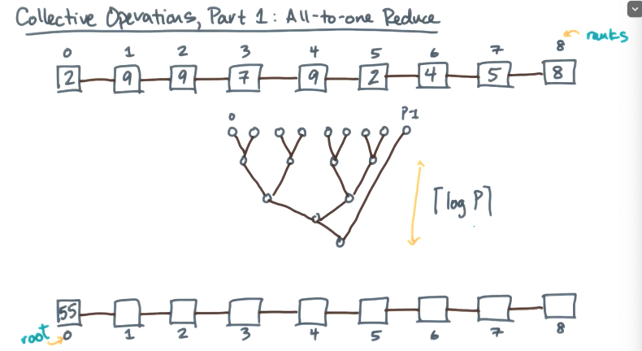

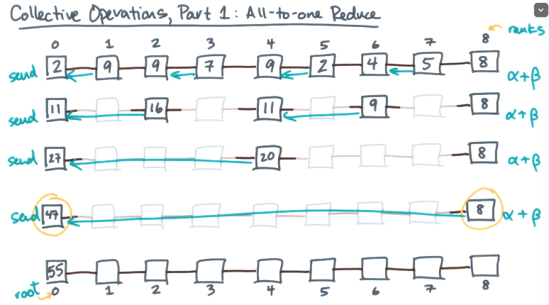

```
// Assume P = 2^k
let s = local value
bitmask <- 1
while bitmask < P do
	PARTNER <- RANK ^ bitmask
	if RANK & bitmask then
		sendAsync(s->PARTNER)
		wait(*)
		break // once sent, drop out
	else if (PARTNER < P)
		recvAsync(t<-PARTNER)
		wait(*)
		s <- s + t // reduce
	bitmask <- (bitmask << 1) // shift left one bit
if RANK = 0 then print(s)

```

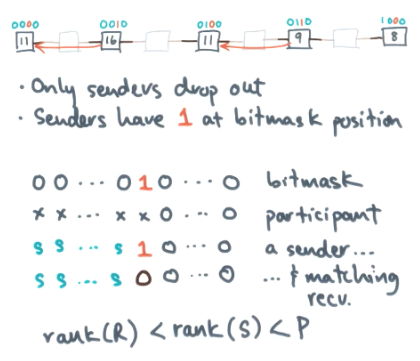


## One to All Broadcast

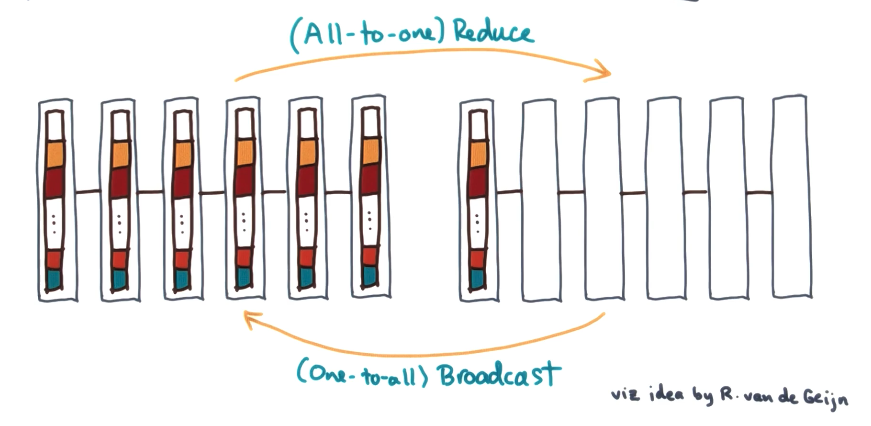

```
broadcast(A[1: m.P], root)
	let B[1:m][1:P] <- reshape(A)
	let T[1:m] = temp array
	scatter(B, root, T)
	allGather(T, B, root) // use bucketing for all gather
	A <- reshape(B)
```

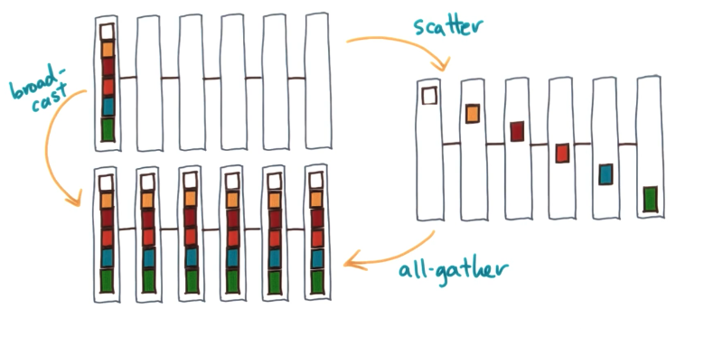

## Scatter & Gather 

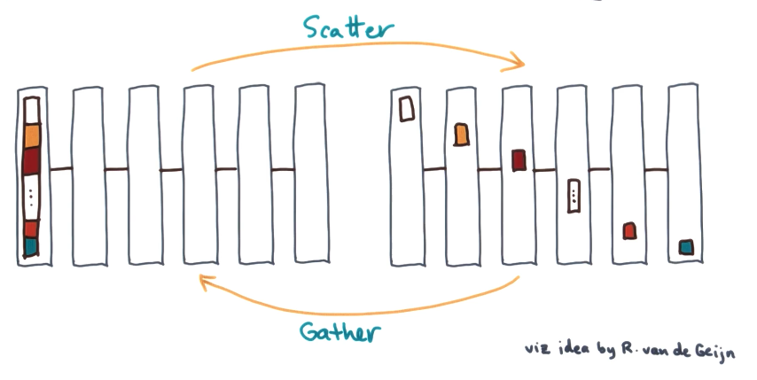

### Scatter Implementation #1: Naive

Tmsg = (alpha + beta * m) * P

```
scatter(In[1:m][1:P], root, Out[1:m])
	if RANK == root then
		for i != root do 
			sendAsync(In[:][i], i)
	else 
		recvAsync(Out[:], root)
	wait(*)
```

Scatter Implementation #2: Divide and Conquer

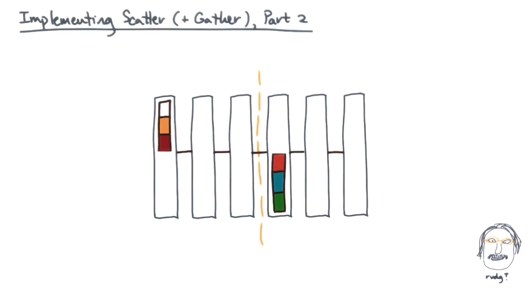

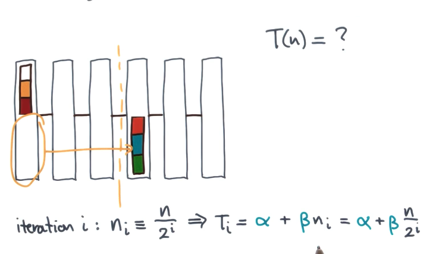

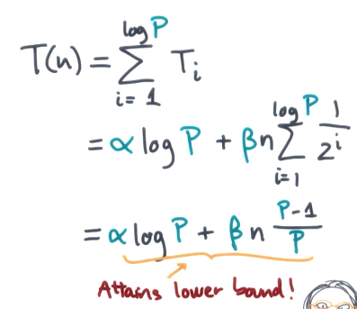

## All-Gather & Reduce-Scatter 

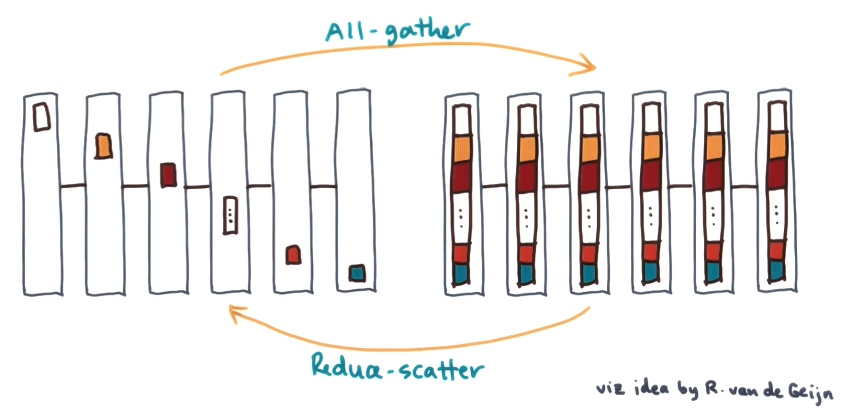

All Gather 

```
// All Gather pseudocode
gather(In, Out, root)
broadcast(reshape(Out), root)
```

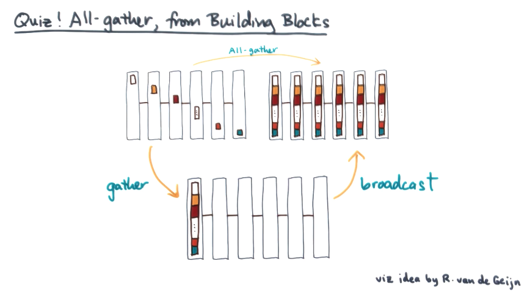


## All-Reduce 

Bandwidth optimal all-reduce with reduce-scatter and all-gather

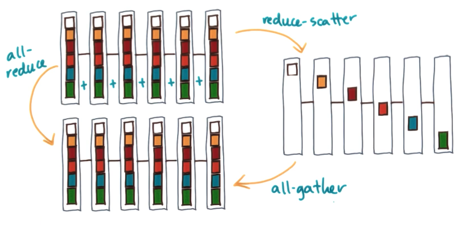 